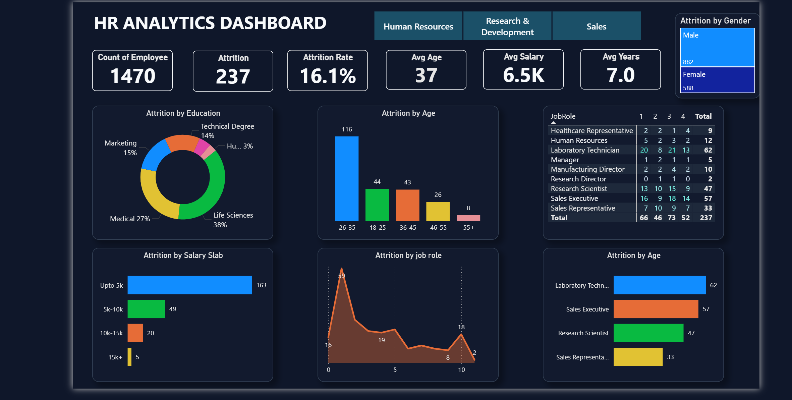

# 🚀 HR Analytics Dashboard | Power BI

  

  📊 <b>Transforming HR Data into Actionable Insights</b> 🚀  

---

## 📌 Project Overview

This project presents a **high-impact HR Analytics Dashboard** built using **Power BI**, designed to uncover key insights related to **employee attrition, demographics, and salary distribution**.

💡 The dashboard enables organizations to:

* Identify workforce trends
* Reduce attrition
* Make data-driven HR decisions

---

## 🎯 Objectives

🎯 Analyze employee attrition patterns
🎯 Identify high-risk departments and roles
🎯 Understand salary and demographic influence
🎯 Enable strategic HR decision-making

---

## 📊 Key Metrics

| Metric              | Value |
| ------------------- | ----: |
| 👥 Total Employees  |  1470 |
| 📉 Attrition Count  |   237 |
| 📊 Attrition Rate   | 16.1% |
| 🎂 Average Age      |    37 |
| 💰 Average Salary   |  6.5K |
| ⏳ Avg Working Years |   7.0 |

## 📈 Dashboard Features

✨ Interactive department filters
✨ Attrition by Education 🎓
✨ Attrition by Age 📊
✨ Attrition by Salary 💰
✨ Attrition by Job Role 👨‍💼
✨ Gender-based analysis 🚻
✨ Clean dark-themed UI 🌙

---

## 🛠️ Tech Stack

🟡 Power BI
📐 DAX (Data Analysis Expressions)
🧹 Data Cleaning & Transformation

## 💡 Business Impact

📉 Reduce employee attrition
📊 Improve HR decision-making
💰 Optimize salary structures
📈 Enhance workforce planning

## 👨‍💻 Author

**Ansh Kumar** 🚀

---
